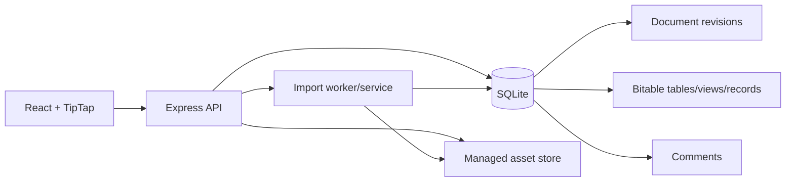

# 飞书文档复刻产品交付计划

> **唯一执行入口。** 本计划基于 2026-07-16 对 `client/src`、`server/src`、全部现有测试和运行配置的代码审计，不以旧任务勾选状态为依据。
>
> **产品目标**：交付一个可靠的单租户飞书文档复刻应用。用户可创建、编辑、保存和重新打开富文本飞书文档；可使用基础块、表格、目录、评论、附件；可在同一文档中使用具有稳定数据模型的多维表格 Grid、画册 Gallery、看板 Kanban 。界面与交互以飞书公开可观察行为为参照，但不复制私有代码或私有协议。

## 1. 交付范围与边界

### 1.1 本期必须交付

| 领域 | 可交付能力 |
| --- | --- |
| 文档 | 创建、打开、标题/图标/封面、自动保存、失败可见、刷新恢复、复制、子文档、模板、删除 |
| 编辑器 | 段落、标题、列表/任务、引用、代码、分割线、Callout、链接、图片、文件、公式、分栏、块拖拽、框选、Slash、块菜单、撤销/重做 |
| 文档结构 | 稳定 block ID、目录、标题折叠、块链接、块/选区评论、评论线程、锚点丢失态 |
| 普通表格 | 输入、选区、行列插删、合并拆分、背景、列宽、HTML/TSV 粘贴、复杂表保护 |
| Bitable | 规范化字段/记录/视图模型；Grid、Gallery、Kanban、记录详情；筛选/排序/分组/字段配置；保存和刷新恢复 |
| 资源 | 上传、预览、失败、重试、取消/删除、静态访问、资源安全边界 |
| 导入 | HTML/Markdown/TXT/ZIP；可信的公开链接/Open API 最佳努力导入；明确质量、warning、未支持块和来源 |
| 质量 | 真正的前后端持久化 E2E、视觉回归、键盘/焦点可用性、错误恢复、性能基线、构建与安全门禁 |

### 1.2 明确不在本期承诺

- 多人实时协同、Yjs、冲突合并和在线光标。
- 企业级组织、ACL、共享链接、审计合规；若部署到非受信任网络，必须先完成第 3 阶段的身份与授权工作。
- 复刻飞书私有服务、私有渲染实现或保证任意外部公开页 $100\%$ 可导入。
- Calendar、Form、自动化、仪表盘编辑器、依赖/关键路径等未达成熟度的 Bitable 功能。已有入口必须隐藏或明确禁用，不能以“可选字段/菜单”形式假装可用。

### 1.3 产品完成定义

产品不是“组件能显示”。一个能力仅在同时满足以下条件时才算完成：

1. 有稳定数据合同和迁移策略。
2. 鼠标、键盘、取消、错误和边界路径都有定义。
3. 保存后刷新、重新打开以及跨视图切换均保留正确状态。
4. 具有局部视觉基线和飞书参照说明。
5. 通过单元、真实服务集成、浏览器和可访问性测试。
6. 没有暴露无效按钮、占位 alert、乱码文案或“看上去能用但不会保存”的能力。

## 2. 审计后的现状

### 2.1 已有资产，保留并修复

| 资产 | 代码真源 | 当前价值 |
| --- | --- | --- |
| TipTap 文档编辑器 | `client/src/components/Editor/Editor.tsx` | 已有大量自定义块、表格、媒体、块交互和保存回调；但入口过大且依赖全局 DOM 事件 |
| 文档会话页 | `client/src/components/Layout/DocumentPage.tsx` | 已有加载、自动保存、目录、标题折叠和评论协调逻辑 |
| 普通表格 overlay | `client/src/components/Editor/tables/` | 已实现选区、轨道、合并拆分和菜单，需补数据安全和回归 |
| Bitable 原型 | `client/src/components/Bitable/` | 已有 Grid、Gallery、Kanban、记录弹窗和模型，但模型/交互一致性不足 |
| 导入管线 | `server/src/import/`、`feishuPublicImporter.ts` | 已具备 Open API/公开 HTML/文件导入、资源镜像、质量字段和映射表 |
| API 与本地数据 | `server/src/routes/`、`database.ts` | 已有 CRUD、评论、模板、上传与 JSON 持久化，是迁移的清晰起点 |
| 浏览器回归 | `client/tests/` | 已覆盖大量局部交互，尤其表格与 Bitable 的基本展示/portal |

### 2.2 必须正视的产品阻断项

| 严重度 | 事实 | 直接影响 | 处置阶段 |
| --- | --- | --- | --- |
| P0 | `server npm run build` 当前有 TypeScript 编译错误 | 无可信基线，无法发布 | 0 |
| P0 | JSON 文件全量同步读写，无版本、锁或事务 | 自动保存可丢失更新，导入会阻塞请求 | 1 |
| P0 | 文档 HTML、模板与上传内容没有明确安全边界；远端资源/重定向存在 SSRF 与 token 外泄风险 | 公开链接导入不安全，生产部署不可接受 | 1 |
| P0 | 前端 E2E 几乎都 mock API | 当前绿测不证明保存、上传、评论、模型刷新或前后端协议 | 2 |
| P0 | Bitable 完整模型被嵌入 TipTap HTML 的 `data-model` | 结构版本、资源归属、查询和并发不可控 | 3 |
| P1 | Bitable 字段声明超过实际值类型与运行时能力 | 用户能创建“公式/关联/人员”等不会工作的字段 | 3 |
| P1 | 选择项在 Grid/画册/看板中混用名称和 ID | 重命名、删除、分组会破坏数据或产生歧义 | 3 |
| P1 | 读模式未成为 Bitable 的强制编辑权限 | 文档只读时仍可能修改多维表格 | 3 |
| P1 | 复杂浮层分别管理 portal、Esc、焦点和 outside-click | 菜单误关、焦点逃逸、键盘不可用、modal 层级失控 | 4 |
| P1 | 导入“full”与真实结构保真不完全一致 | 用户可能误判导入质量 | 6 |

## 3. 目标架构

### 3.1 数据与 API

从 JSON 文件原型迁移为 SQLite（或同等事务型本地数据库），保留 REST API，但改为显式资源模型：



**最低数据合同：**

- `documents`：标题、TipTap HTML/JSON、图标、封面、父级、`version`、创建/更新时间。
- `document_revisions`：每次显式或自动保存的修订，至少可回滚最近版本；第 1 版可按有限数量保留。
- `assets`：归属文档、文件名、MIME、大小、存储路径、状态、创建时间；不可只把临时 object URL 写进 HTML。
- `comments`：按 `document_id + comment_id` 更新，包含稳定 block/selection anchor。
- `bitable_tables`、`bitable_fields`、`bitable_records`、`bitable_views`、`bitable_view_filters`、`bitable_view_sorts`：从 HTML 属性中移出为规范化主数据。TipTap Bitable node 仅保留 `tableId`、`blockId` 和展示属性。
- 所有可变资源使用 `version` 或 `updated_at` 的乐观并发；客户端在 `409` 时提供重载/重试策略，不能静默覆盖。

### 3.2 Bitable 值模型

禁止“所有字段都存 string”。字段能力与值形状必须一一对应：

| 字段 | 首版策略 | 值合同 |
| --- | --- | --- |
| 文本、富文本、数字、日期、勾选、URL、电话、邮箱 | 必须完整实现 | 标量或受限富文本结构 |
| 单选、多选 | 必须完整实现 | 记录只存稳定 `choiceId` 或 `choiceId[]`，显示名只在渲染时解析 |
| 附件 | 必须完整实现 | `assetId[]`，不得存临时 URL 作为真源 |
| 创建/更新时间、创建/更新人 | 必须完整实现 | 服务端只读系统字段 |
| 公式 | 先只支持明确的表达式子集；否则不展示创建入口 | 已编译表达式与只读计算值 |
| 关联、查找、人员 | 第一期隐藏，不创建假字段 | 后续通过明确关系模型加入 |

每个视图持有自身的 `fieldOrder`、隐藏字段、筛选、排序和配置。全局 `fields` 只表示表结构，不得因一个视图拖动字段而改变全部视图。

### 3.3 前端边界

- `DocumentPage` 只负责路由会话、保存状态、加载取消、版本冲突与页面级布局。
- `Editor` 拆为扩展注册、文档状态桥接、块交互、媒体、表格和浮层协调层；不再在单一文件混合 NodeView、上传、保存、DOM 事件和 UI。
- Bitable 使用 reducer/command service 管理 `updateCell`、字段变更、选项改名/删除、记录移动、视图配置和上传生命周期。视图组件只渲染并发送命令。
- 建立唯一 `OverlayProvider`：注册 portal 根、modal 边界、焦点返回、Escape 优先级、outside-click 和定位 clamp。所有菜单/日期/附件/选择器必须接入。
- 网络只通过 `client/src/api/`；禁止 NodeView 中散落 `fetch`/XHR。上传提供 `AbortController`、进度、重试和清理。

## 4. 实施总路线

严格按阶段推进。一个阶段未通过发布门禁，不启动下个阶段的功能扩展。每次会话只处理一个任务 ID。

| 阶段 | 名称 | 目标 | 完成门槛 |
| --- | --- | --- | --- |
| 0 | 工程基线与真相校准 | 让构建、测试、文档、编码和现状可被信任 | 全部构建绿；差距台账、测试矩阵和真实 fixture 可用 |
| 1 | 安全与持久化地基 | 让任何编辑、上传和导入不丢数据且可安全运行 | 事务数据层、版本、输入/导入/上传防护、真实 API 测试 |
| 2 | 文档核心编辑闭环 | 把普通文档从演示变成可靠编辑器 | 所有基础块、评论、表格保存/刷新/失败路径通过 |
| 3 | Bitable 数据内核 | 建立可信字段、记录、选择项、视图和资产模型 | 模型迁移、命令层和 CRUD/版本测试通过 |
| 4 | Grid 表格画板 | 完成高频表格编辑体验、规模和无障碍基础 | Grid 的编辑/筛选/排序/分组/层级/键盘/刷新通过 |
| 5 | Gallery 与记录详情 | 完成画册卡片、封面、字段布局、资源和记录编辑 | Gallery/Modal 的 CRUD、焦点、资源、刷新通过 |
| 6 | Kanban 收敛 | 在稳定模型上完成看板次级视图 | 移动/拖放替代、锁定和刷新通过 |
| 7 | 导入保真与资源管线 | 可信地导入，不夸大质量 | 版本化语料、结构 diff、质量降级与资源安全通过 |
| 8 | 产品质量与发布 | 视觉、响应式、可访问性、性能和运维可交付 | 发布门禁全绿，缺陷台账无 P0/P1 |

### 执行记录

| 任务 | 状态 | 验证记录 |
| --- | --- | --- |
| 0.1 | 已完成 | 服务端构建通过；服务端测试 37/37；客户端构建通过；客户端 Playwright 114/114（Chromium，4 workers，2026-07-16） |
| 0.2 | 进行中 | 建立高频用户流差距台账与体验参照 |

0.1 同时修复了链接卡片“自动选中即进入编辑态”、Bitable 浮层旧定时器关闭新面板，以及公开样本烟测共享总超时三项基线缺陷。

## 5. 阶段任务卡

### 阶段 0：工程基线与真相校准

#### 0.1 修复编译、编码与运行配置

**文件**：`server/src/documentImporter.ts`、`server/src/import/feishuApiClient.ts`、`client/vite.config.ts`、`README.md`、`package.json`。  
**工作**：修复当前服务端 TypeScript 报错；统一 README、Vite、Playwright 端口；运行非破坏性乱码扫描并修复可见/ARIA 文案；移除或隔离会修改源文件的调试脚本。  
**验收**：

```powershell
cd server; npm run build; npm test
cd ../client; npm run build; npm run test:e2e
```

构建和测试必须有可记录的最终退出码；不得以“命令正在运行”视为通过。

#### 0.2 差距台账与体验参照

**文件**：新建 `docs/quality/feature-gap-register.md`、`docs/quality/reference-capture/`。  
**工作**：为每个高频用户流记录飞书参照、操作步骤、当前行为、期望、严重度、拥有模块、自动化测试和截图。至少覆盖：文档输入、Slash、块菜单、标题折叠、目录、评论、普通表格、Grid、Gallery、Kanban、Record Modal、导入、上传。  
**验收**：不少于 30 条可复现项目；每条都能定位代码和测试；按 P0/P1/P2 排序。

#### 0.3 测试分层与真实服务夹具

**文件**：`client/package.json`、`client/playwright.config.ts`、`client/tests/fixtures/`、`server/tests/`。  
**工作**：引入快速 unit runner（Vitest 或等价方案）；创建真实 Express + 独立临时 SQLite/资源目录的集成测试命令；保留 API mock 测试只用于局部失败态；创建 seed/cleanup 工具。  
**验收**：同一套用例能证明“编辑 -> PUT -> DB -> GET -> 页面刷新”；并行用例之间没有数据泄漏。

### 阶段 1：安全与持久化地基

#### 1.1 事务数据库与文档版本

**文件**：替换 `server/src/database.ts`，新增 migration/repository 层、document version API；`client/src/api/documents.ts`、`DocumentPage.tsx`。  
**工作**：迁移 JSON 数据；所有更新接受版本；实现原子更新、版本冲突 `409`、有限修订历史；加载请求可取消或按路由/请求序列拒绝陈旧响应；页面卸载采用可靠的保存策略或明确的草稿恢复。  
**验收**：并行保存、快速切换文档、保存失败、刷新中断、进程重启均有集成测试；无静默覆盖。

#### 1.2 输入、HTML、上传与外连安全

**文件**：`server/src/routes/documents.ts`、`uploads.ts`、`documentImporter.ts`、`import/assetPipeline.ts`、`feishuPublicImporter.ts`、前端预览组件。  
**工作**：定义 HTML allowlist 与 URL/CSS policy；服务端验证所有请求；禁止危险 URL/主动内容；限制 ZIP 解压总量/条目数；远端拉取仅 HTTPS、允许主机、逐跳验证重定向、禁止私网、超时/大小/MIME 限制；绝不向非可信资源 URL 转发飞书 token。修复评论 PATCH 的跨文档先写后校验问题。  
**验收**：XSS、`javascript:`、恶意 SVG、ZIP bomb、重定向到 loopback、超大资源、token 外泄和跨文档评论的回归测试均通过。

#### 1.3 API 合同与错误体验

**文件**：`server/src/routes/*`、`client/src/api/*`、`DocumentList.tsx`、`DocumentPage.tsx`。  
**工作**：为文档、模板、评论、导入、上传建立 runtime schema；统一 `{ code, data, error }` 语义、错误码、超时、取消和 toast；不展示尚未实现的“共享/点赞/翻译/附件”等假能力。  
**验收**：4xx/409/422/500、离线、超时、取消、重复提交均有浏览器用例和可理解 UI。

### 阶段 2：文档核心编辑闭环

#### 2.1 编辑器状态与扩展拆分

**文件**：`Editor.tsx`、`Editor/blocks/`、`Editor/menus/`、`Editor/media/`、`DocumentEditor/`。  
**工作**：保持行为不变地拆出 extensions、NodeView、文档同步、媒体命令和浮层事件；删除全局事件的隐式依赖或为每个事件定义 typed contract、生命周期和文档 ID 隔离。  
**验收**：现有 editor E2E 先原样绿；拆分后新增至少一条跨文档切换和卸载清理测试。

#### 2.2 基础块与键盘行为

**范围**：段落、标题、列表/任务、引用、代码、Callout、公式、分栏、图片、文件、嵌入。  
**工作**：逐块完成输入、选中、删除、空块退格降级、复制/粘贴、撤销/重做、Slash 搜索、Esc、焦点维持、稳定 blockId 和刷新恢复。  
**验收**：每类块至少有“创建/编辑/取消或边界/保存刷新”四步 E2E；不可编辑块显示明确只读态。

#### 2.3 目录、块链接与评论

**文件**：`Layout/Sidebar.tsx`、`CommentSidebar.tsx`、`Editor/blocks/comment*`、`headingCollapse.ts`。  
**工作**：修复路由/加载竞态；目录在长文档中稳定吸顶、跳转、当前高亮与标题折叠同步；评论按 blockId/selection anchor 恢复，支持创建、回复、编辑、删除、解决、锚点丢失；正文保存成功后才清理孤儿评论。  
**验收**：插入/删除块、刷新、打开块链接、长目录、评论侧栏和评论失败路径均通过真实 API E2E。

#### 2.4 普通表格数据安全

**文件**：`Editor/tables/`。  
**工作**：定义表格 HTML 规范化器；修复选区、合并/拆分、行列插删、列宽、背景、粘贴和复杂 span 表的保护；危险重排给出禁用与原因，不能破坏未选内容。  
**验收**：普通、粘贴、复杂 span 三种 fixture 在操作前后做结构 diff；保存刷新后 HTML 与视觉状态一致。

### 阶段 3：Bitable 数据内核

#### 3.1 模型迁移与版本化

**文件**：`Bitable/model/bitableModel.ts`、新 server Bitable repository/API、TipTap NodeView。  
**工作**：给现有 `data-model` 加 schema version 和迁移器；导入历史 HTML 后抽取为数据库表；TipTap 节点改为 `tableId` 引用；可回滚迁移。  
**验收**：旧 Grid/Gallery/Kanban fixture 可无损迁移；parse/serialize/迁移幂等；坏模型得到可恢复错误而不是白屏。

#### 3.2 字段和值合同

**文件**：模型、字段编辑器、record modal、Grid/Gallery/Kanban。  
**工作**：实现 §3.2 的首版字段；单选/多选只存 choice ID；选项改名不改记录值；删除选项先要求重新分配或明确清空；系统字段只读；不支持字段从创建菜单移除。  
**验收**：字段类型矩阵逐项通过；重复名称选择项不串数据；重命名/删除选择项、字段转换和刷新均可预测。

#### 3.3 Bitable 命令层与历史

**文件**：新 `Bitable/commands/`，收敛 `BitableBlockView.tsx` mutation。  
**工作**：实现唯一命令入口：单元格更新、批量更新、字段/选项、记录层级、附件、视图配置、删除/恢复；对记录和结构操作写完整 history。  
**验收**：所有命令有 unit test；任一视图不直接突变 model；只读文档和锁定视图无法发出 mutation。

#### 3.4 资源与记录评论

**文件**：上传 API、资产表、`BitableRecordCardModal.tsx`、评论模块。  
**工作**：附件使用 asset ID；支持进度、取消、重试、移除和 orphan cleanup；明确记录评论与文档评论的关系，第一期可持久化为记录线程但必须支持编辑/删除。  
**验收**：失败、取消、重复上传、删除记录/附件、刷新和权限/锁定均有测试；没有 object URL 持久化。

### 阶段 4：Grid 表格画板

#### 4.1 Grid 布局与性能内核

**文件**：`BitableGridView.tsx`、共享 layout module。  
**工作**：集中列宽/行高/冻结区/滚动/viewport 指标；移除每帧无条件菜单定位；使用 map/index 代替渲染循环中的 `findIndex`；实现行虚拟化和可测量的 canvas/overlay 对齐。  
**验收**：1000 行 x 30 列 fixture 可滚动、编辑、选择；缩放/resize/横向滚动时 overlay 不漂移；设定并达成首屏、滚动与编辑延迟预算。

#### 4.2 Grid 功能闭环

**工作**：字段创建/改名/类型/描述/隐藏/删除、列宽、行高、单元格编辑、选择范围、批量粘贴、附件、筛选、排序、多级分组、层级记录、增删/移动记录。  
**验收**：每个命令在“执行 -> API 保存 -> 刷新 -> 重开 Grid”后完整恢复；菜单在窄宽和滚动边界处 clamp；无 inert 菜单项。

#### 4.3 Grid 键盘与语义

**工作**：实现可访问 grid 或提供一致的 DOM fallback；箭头、Tab/Shift+Tab、Enter、Escape、复制/粘贴和范围选择；为拖拽提供键盘移动替代。  
**验收**：键盘可完成添加、编辑、选择、移动、打开/关闭菜单；axe 无关键违规；屏幕阅读器获得行/列/单元格上下文。

### 阶段 5：Gallery 画册与记录详情

#### 5.1 Gallery 卡片合同

**文件**：`BitableGalleryView.tsx`、`BitableCardField.tsx`、视图配置。  
**工作**：实现画册独立 `fieldOrder`、封面字段/裁剪/比例、卡片大小/布局、空字段、分组、选中、批量操作、搜索/筛选/排序；卡片是键盘可操作元素。  
**验收**：字段在画册中重排不影响 Grid；封面/字段/分组/过滤保存刷新一致；长标题、空封面、多附件、窄屏无溢出。

#### 5.2 Record Modal 产品化

**文件**：`BitableRecordCardModal.tsx`、共享 overlay。  
**工作**：支持完整字段编辑、附件、日期、历史、记录评论、前后记录导航；modal trap focus、关闭时归还焦点、背景 inert；日期/附件子浮层仅在白色 modal 内；统一 Esc 优先级。  
**验收**：鼠标和纯键盘可编辑并关闭；错误/取消不误保存；子浮层不越界；刷新后记录/评论/附件/历史正确。

### 阶段 6：Kanban

#### 6.1 Kanban

**工作**：以 choice ID 分列；实现安全的新建/改名/隐藏/排序/删除分组，删除需重分配；实现同列排序与跨列移动、键盘替代、锁定态；视图字段顺序与 Gallery 独立。  
**验收**：卡片移动、排序、分组变更保存刷新；删除不静默清空记录；鼠标/键盘/触控至少有一种可靠替代交互。

### 阶段 7：导入保真与资源管线

#### 7.1 版本化导入语料与结构 diff

**文件**：新增 `server/tests/fixtures/import/`、导入测试、质量报告。  
**工作**：建立合法脱敏的 Open API block、导出 HTML/ZIP、公开页 IR 语料；对 paragraph、heading、list、code、quote、image、file、table、equation、column、bitable 逐项断言输入结构、输出本地节点/表模型、warning、asset 和未支持块。  
**验收**：任何 `full` 声明都有字段级结构 diff 证明；不能保留 sort/filter/审计字段时自动降级为 `partial`。

#### 7.2 公开导入诚实性

**工作**：将合成 business-report/quickstart/snapshot 输出标记为“演示 fixture”而非源文档；公开 HTML 只能基于真实可见内容；保存 source provenance、质量和 loss report。  
**验收**：前端清晰展示质量、warning、未支持块、来源和合成状态；失败绝不创建空文档。

### 阶段 8：产品质量与发布

#### 8.1 视觉、响应式与可访问性

**工作**：Playwright 项目覆盖 Chromium desktop 1440、desktop 1024、mobile 390、tablet 768，以及 Firefox/WebKit 核心烟测；增加截图基线（文档、表格、评论、Slash、Grid、Gallery、Kanban、Record Modal）；接入 axe；统一 `data-testid` 与语义 role。  
**验收**：视觉差异需人工批准；关键流程无高/严重 axe 违规；任何 modal/menu 均可键盘操作、焦点不丢失。

#### 8.2 性能、监控与发布流程

**工作**：建立大文档、1000x30 Grid、500 卡片 Gallery、导入大文件的性能 fixture；记录 Web Vitals、错误、未处理 rejection、API 失败和导入结果；CI 输出 trace、截图 diff、server log、导入报告。  
**验收**：性能预算写入 CI；关键流程无 console error/failed request；发布前缺陷台账没有 P0/P1。

## 6. 测试矩阵与发布门禁

### 6.1 分层测试

| 层级 | 目的 | 运行内容 |
| --- | --- | --- |
| Unit | 模型、迁移、命令、解析、序列化、过滤/排序/公式 | 快速、无浏览器、每次提交 |
| Server integration | API schema、SQLite、版本冲突、资源、导入、安全 | 临时 DB/资源目录、每次提交 |
| Full-stack E2E | 不 mock 文档/评论/上传 API 的真实保存与刷新 | PR 核心集 |
| Browser interaction | 内容编辑、表格、Grid、Gallery、Kanban、modal | Chromium PR，跨浏览器 nightly |
| Visual | 稳定 fixture 局部快照 | PR 核心与人工审查 |
| Accessibility | axe、键盘、焦点 trap/restore、reduced motion | PR 核心 |
| Performance | 大数据和导入预算 | nightly/release |

### 6.2 最低发布门禁

1. `server build`、`server test`、`client build`、unit、integration、核心 E2E 全绿。
2. 文档、评论、上传、表格和每个 Bitable 视图至少一条真实服务“修改 -> 保存 -> 刷新 -> 断言”流程。
3. 没有 P0/P1 安全、丢数据、只读绕过、无效字段或乱码缺陷。
4. Chromium desktop/mobile 的关键流全绿；Firefox/WebKit 的编辑、保存、表格、Grid/Gallery 烟测全绿。
5. 所有既定视觉基线通过且有人工审阅记录。
6. 关键页面/弹窗没有高或严重可访问性问题，完整键盘路径可完成。
7. 导入状态准确：每项 `full` 可由语料证明；最佳努力导入明确标为 `partial`/`fallback`。

## 7. 会话执行规则

1. 从本计划选择一个未完成任务，先把任务、参照、风险和验收写入 PR/会话说明。
2. 先读直接控制该行为的代码和现有测试，写出可被测试否定的本地假设。
3. 先补/收紧失败测试，再做最小实现；不得因为一张截图修改全局 CSS。
4. 修改后立即运行最小测试；通过后再运行本任务的保存刷新、视觉和可访问性验证。
5. 只在所有验收项成立时更新任务状态。发现相邻问题时进入差距台账，不能跨范围顺手重构。

### 完成回报模板

```markdown
## 交付回报
- 任务：<阶段.任务>
- 用户流：<触发 -> 操作 -> 成功/取消/错误 -> 刷新>
- 飞书参照：<脱敏截图/录屏/手工操作说明>
- 数据合同变更：<schema/API/migration；无则写无>
- 直接控制模块：<文件与根因>
- 自动化证据：<unit/integration/E2E/visual/a11y>
- 验证命令与结果：
- 性能影响：<测量或不适用>
- 遗留差距：<可观察事实>
- 下一个任务：
```

## 8. 建议启动顺序

1. `0.1`：先恢复可构建、可测试的基线。
2. `0.3`：建立真实服务保存/刷新测试，作为所有后续改动的安全网。
3. `1.1` 与 `1.2`：先消除丢数据和导入安全问题。
4. `2.2`、`2.3`、`2.4`：把普通文档主路径做成可靠闭环。
5. `3.1`、`3.2`、`3.3`：先修 Bitable 模型，再修视图；绝不反过来只调 UI。
6. `4`：优先 Grid 表格画板，这是多维表格最重要的日常入口。
7. `5`：完成画册和记录详情，确保卡片与数据不是两套状态。
8. `6`：在稳定模型上收敛 Kanban。
9. `7`、`8`：最后以真实导入、跨浏览器、视觉、无障碍和性能门禁完成发布。

这条顺序的原则很简单：先让数据可信，再让操作可靠，最后让视觉和完整度接近飞书。只有这样，已有的大量组件才会从演示能力变成产品能力。